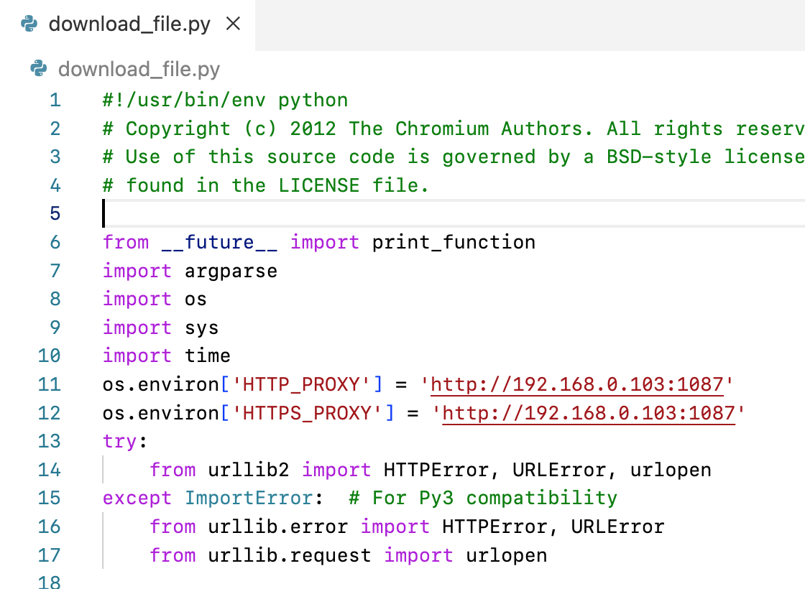

## 参考资料

- [How to call deno in rust? #17345](https://github.com/denoland/deno/discussions/17345)
- [使用 Rust 和 eno_core 创建您自己的 JavaScript 运行时](https://zenn.dev/k41531/articles/3896b8d496ebe0)
- [rust axum 项目实践 deno js运行时集成](https://blog.csdn.net/qq_15935157/article/details/124332463)
- [refactor(runtime): "Worker::execute_script" returns value #17092](https://github.com/denoland/deno/pull/17092)
- [处理 v8:Global<v8:Value>](https://github.com/denoland/deno/discussions/12635)

## 问题

- 有个特别要注意的地方: rusty_v8 的版本兼容问题

    Cargo.toml 中的 crate, 包括 deno_core, deno_runtime, serde_v8 这些 crete, 注意一定底层的 rusty_v8 版本一定要相同
    因为 rusty_v8 是 v8 引擎的 Rust 绑定, rusty_v8 应该是跟着 v8 引擎的接口一起变化的,
    不同的 rusty_v8 版本肯定是相互不兼容的.
    查看一个 crate 依赖了哪些其他的 crete, 可以参考这个连接(Dependencies标签):
    https://crates.io/crates/serde_v8/0.121.0/dependencies

- Deno 中的 globalThis 是什么东西？

`globalThis` 在 Deno 中是指向全局对象的引用,它提供了一个标准的方式来访问全局对象,无论是在浏览器还是 Node.js 环境中。
一些关键点:
- globalThis 替代了浏览器中的 window 和 Node.js 中的 global。它提供了一个统一的方式来访问全局对象。
- 在 Deno 中,全局对象就是 module 作用域,globalThis 指向的就是这个 module 作用域。
- 通过 globalThis 你可以访问所有在 module 作用域定义的变量和函数。
- globalThis 遵循 ECMAScript 规范,可以确保无论在什么 JavaScript 环境中,它总是指向全局对象。
- 使用 globalThis 而不是直接使用 global 是一个好习惯,global 在不同环境可能指向不同的对象,但 globalThis 总是指向全局对象。
- Deno 默认不允许访问全局对象,需要使用 --allow-all 选项。使用 globalThis 可以规避这个限制。

所以在 Deno 中,你可以使用 globalThis 来安全可靠地访问全局作用域,这与直接使用全局变量相比是一个更好的选择。

- deno_runtime 中的 deno_core 版本和Cargo.toml 引入的 deno_core 版本不匹配导致如下多次定义的问题

    ```
    /root/.cargo/registry/src/index.crates.io-6f17d22bba15001f/v8-0.78.0/src/inspector.rs:196: multiple definition of `v8_inspector__V8InspectorClient__BASE__consoleAPIMessage'; /root/rust/rust-demo/target/debug/deps/libv8-99cb9bdadd322885.rlib(v8-99cb9bdadd322885.v8.ebceacab2b7ad3ad-cgu.08.rcgu.o):/root/.cargo/registry/src/index.crates.io-6f17d22bba15001f/v8-0.76.0/src/inspector.rs:196: first defined here
            collect2: error: ld returned 1 exit status
    ```

- 编译时 librusty_v8 静态库下载的问题, 找到下载脚本, 

```
(base) ➜  deno_runtime_demo git:(main) ✗ locate download_file.py
/root/.cargo/registry/src/index.crates.io-6f17d22bba15001f/rusty_v8-0.22.3/tools/download_file.py
/root/.cargo/registry/src/index.crates.io-6f17d22bba15001f/rusty_v8-0.32.1/tools/download_file.py
/root/.cargo/registry/src/index.crates.io-6f17d22bba15001f/v8-0.75.1/tools/download_file.py
/root/.cargo/registry/src/index.crates.io-6f17d22bba15001f/v8-0.78.0/tools/download_file.py

# 全部增加环境变量
os.environ['HTTP_PROXY'] = 'http://192.168.0.103:1087'
os.environ['HTTPS_PROXY'] = 'http://192.168.0.103:1087'
```

编译 deno_runtime 这个 crate, 依据 [rusty_v8](https://github.com/denoland/rusty_v8) 仓库 README 的介绍设置了 `RUSTY_V8_MIRROR` 环境变量
, 但是不起作用, 需要 Hack 一下 Python 的下载脚本



